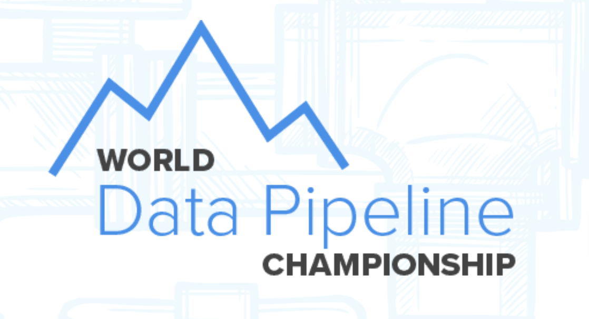
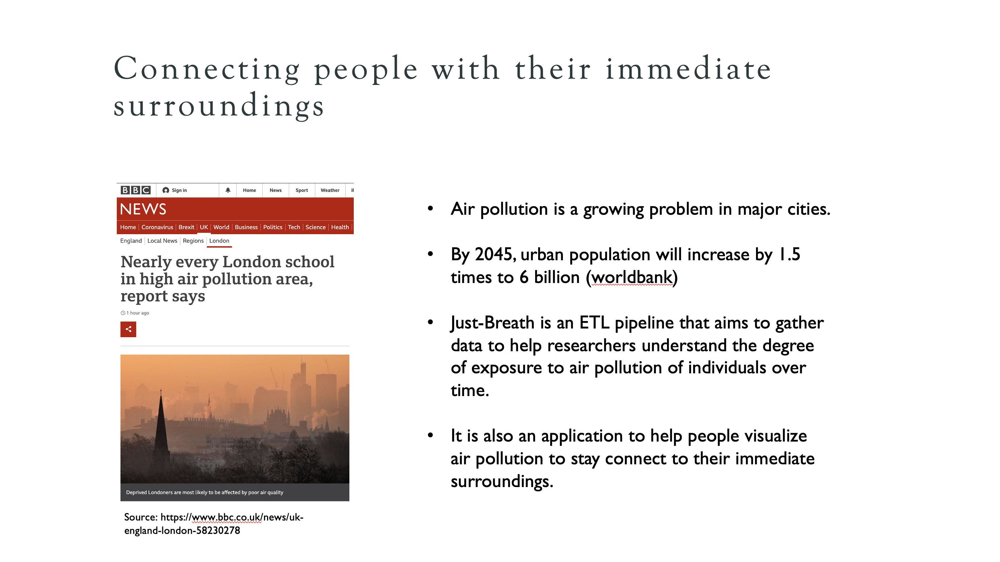
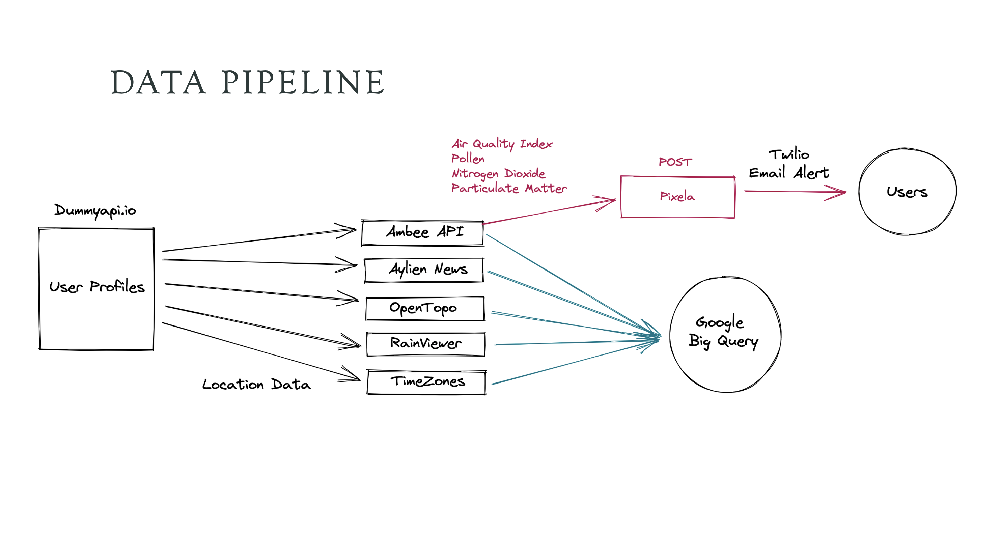
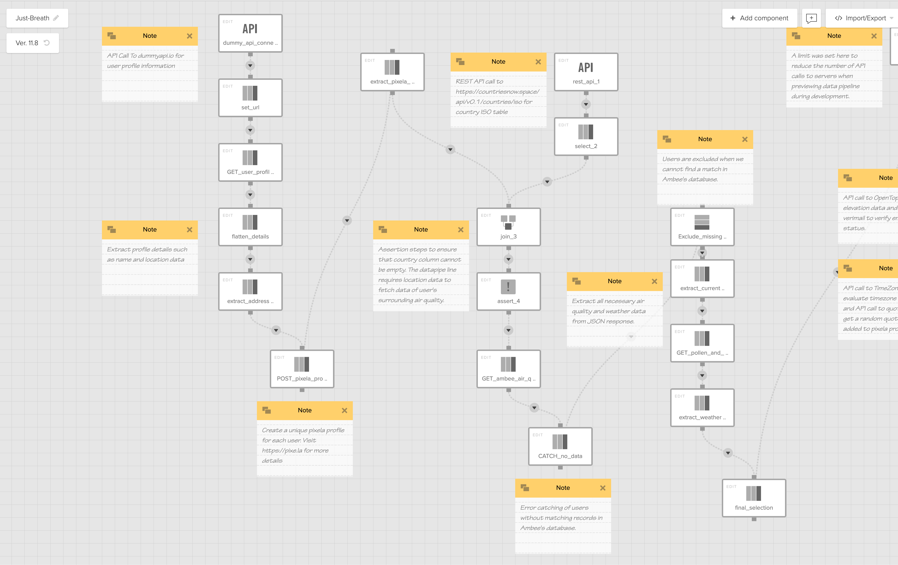
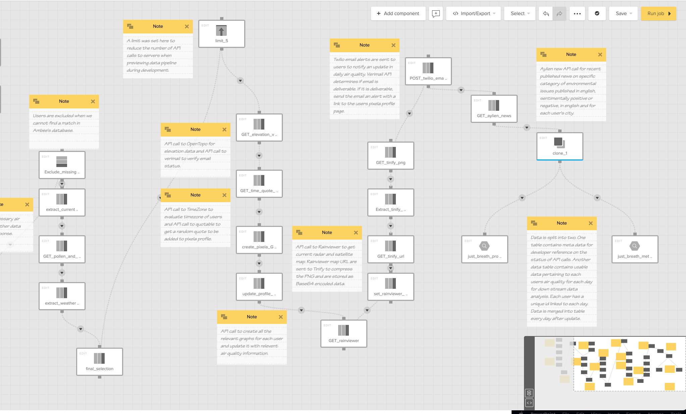
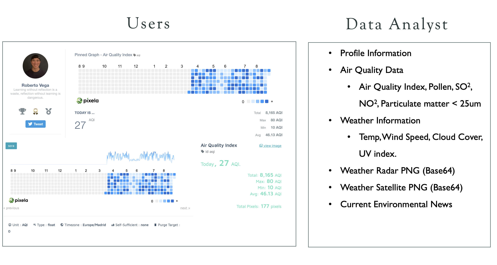

<h1>What is the World Data Pipeline Championship?</h1>
 

The Data Pipeline Championship is an event in August 2021 bringing together hundreds of data engineers from around the world to compete for $10,000 in prizes.

Participants are challenged to create the most interesting datasets and data pipelines using publicly available datasets, API partners, and the Xplenty platform.

At the end of the competition, the community voted on submissions, and finalists was judged by a panel of senior data engineers from multiple companies. More details can be found [here](https://www.datapipelinewc.com). This readme details the submission I made for the competition which claimed first prize and community favourite!

Please view the video introduction [here](https://drive.google.com/file/d/1-6Od-d41dUmUPlIuhexzI5AeWrGIU6Nt/view?usp=sharing)

<h1>Competition Submission</h1>
 

### Context

The Just Breathe ETL pipeline aims to connect people with their immediate surroundings. Against the backdrop of increasing air pollution around the world, I wanted to create an application that helps people visualise air pollution over time and raise awareness of a seemingly invisible growing threat. 
 

### API's used

1.	Ambee (https://www.getambee.com)
2.	Pixe.la (https://pixe.la)
3.	Timezonedb (https://timezonedb.com)
4.	OpenTopoData (https://www.opentopodata.org)
5.	Quotable (https://github.com/lukePeavey/quotable)
6.	Dummyapi (https://dummyapi.io)
7.	Verimail (https://verimail.io)
8.	Rainviewer (https://www.rainviewer.com)
9.	Tinify (https://tinypng.com)
10.	Twilio SendGrid (https://sendgrid.com)
11.	Aylien (https://aylien.com)
12.	Countriesnow (https://countriesnow.space)

### Pipeline Description

The ETL pipeline gets dummy profiles from dummpyapi.io and extracts useful location information that feeds a query into multiple other APIs such as Ambee, TimeZone, OpenTopo and Rainviewer. Data from Ambee pertaining to the user’s local air conditions such as Nitrogen Dioxide, particulate matter, and air quality indexes are visualised via pixe.la. “Pixe.la” is a web application that provides the opportunity to visualise air quality conditions over time. Pixe.la visualises air quality data very much like a github commit activity graph. A notification is sent via Twilio Sendgrid to users every time the pipeline is ran to notify users that their graph had been updated. For each user, the pipeline extracts and loads data pertaining to air pollution, weather conditions, weather maps and location specific environmental news into a big query database. It is my hope that this pipeline can raise awareness of air pollution and help scientists better understand the effects of long-term air pollution. 

### Xplenty Pipeline Overview

### Pipeline output
Data from Ambee pertaining to the user’s local air conditions such as Nitrogen Dioxide, particulate matter, and air quality indexes are visualised via pixe.la. Data is visualised similar to that of a github commit chart. The final aggregation of data will include data pertaining to air quality, weather information and current environmental news related to each user's location.
